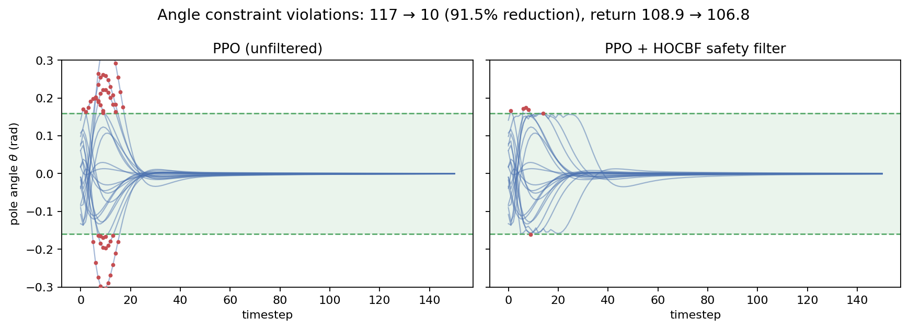

# Safe RL with Control Barrier Functions

<p align="center">
  
</p>

A safe RL controller is designed for a cart-pole application. First, a PPO policy is trained to keep the pole upright. Then, a control barrier function is added to the scheme to maintain the pole's angle inside a safety region.
**Angle constraint violations: 117 → 10 (91.5% reduction), at a 1.9% cost in return.**


## Results

| Metric                | Baseline (PPO) | PPO + HOCBF filter |
|------------------------|---------------:|--------------------:|
| θ (angle) violations   | 117            | 10 (**−91.5%**)      |
| All-state violations   | 139            | 57 (−59.0%)           |
| Average return         | 108.9          | 106.8 (−1.9%)          |
| Filter interventions   | —              | 86                      |
| Episode failures       | 0              | 0                        |

50 episodes each, on [`configs/cartpole_cbf_eval.yaml`](configs/cartpole_cbf_eval.yaml).

## What this is
- First, the cart-pole stabilization task in the safe-control-gym benchmark is solved, without safety considerations, using a PPO policy.
- Then, it is desired to solve the same task while keeping the pole’s angle within a predefined safety region ($\pm 9$ degrees from the vertical position). This is achieved by designing a safety filter based on a control barrier function (CBF). The filter either certifies or corrects the PPO policy’s actions at every time-step.
- Both results are evaluated and compared, showing that the safe RL scheme reduces the angle constraint violations by over 90% compared against the PPO baseline, without a meaningful sacrifice in performance.

## Method

**Control barrier function (CBF) design.** In safety-critical applications, it is desired that the state of a dynamical system remains within predefined safety boundaries. Control barrier functions [1] are mathematical expressions that evaluate how close is the system from leaving such safe regions. In many applications, a CBF is often defined as a function $h(x)$ such that $h(x) \geq 0$ if and only if $x$ is in the safe set, together with the requirement that at every safe $x$ there exists an admissible input $u$ such that $\dot h(x,u) + \gamma h \geq 0$ . However, these standard CBFs are only applicable to systems with relative degree 1 [2]. The cart-pole system that is of interest in this project has relative degree 2 with respect to the angular position $\theta$: the control input does not appear in $\theta$ or $\dot \theta$, but only in $\ddot \theta$ [3]. Hence, a high-order CBF (HOCBF) [2] is used instead. In this case, a function $h$ is still defined, but additionally an auxiliary barrier is defined as
```math
\psi (x) = \dot h(x) + \gamma_1 h(x),
```
and the CBF condition is now given by
```math
\dot \psi(x,u) + \gamma_2 \psi(x) \geq 0.
```

**Two one-sided barriers, instead of one symmetric barrier.** The barrier function $h$ must now be defined. Since our objective is to keep the pole angle, $\theta$, within $\pm 9$ degrees ($0.16$ rad) of the vertical position, a candidate symmetric barrier could be defined as $h(\theta) = \theta_{\max}^2 - \theta^2$, with $\theta_{max} = 0.16$. However, it was empirically found that this is a poor barrier choice for the following reasons. At every time step, we wish to enforce the condition $\dot \psi(x,u) + \gamma_2 \psi(x) \geq 0$ by determining a suitable control $u$. But the symmetric choice of $h$ implies that the input appears in this condition through a term of the form $-2 \theta \ddot \theta$, which vanishes at $\theta = 0$. Hence, satisfying the CBF condition around the vertical position requires very large, often disruptive forces. This issue was resolved by instead defining *box constraints* (see, e.g., [4]), that is, by using two one-sided barriers of the form
```math
\begin{aligned}
h_1 &= \theta_{\max} - \theta, \\
h_2 &= \theta_{\max} + \theta
\end{aligned}
```
The gradient of each of these functions with respect to $\theta$ is constant ($\pm 1$), preventing the observed problem. Now, each of these functions yields a separate CBF condition, and both are used as separate constraints in the following optimization problem.

**QP formulation.** At each time step, an optimization problem is solved to make sure that the PPO policy will maintain the system states within the safe region. If this is not the case, the nominal input is suitably modified. This optimization problem is formulated as the following quadratic program (QP)
```math
\begin{aligned}
\min_{u,\,\sigma} \quad & \|u - u_{\text{nominal}}\|^2 + \rho\|\sigma\|^2 \\
\text{s.t.} \quad & \dot\psi_i(x, u) + \gamma_2 \psi_i(x) + \sigma_i \geq 0, \quad i = 1, 2 \\
& \sigma \geq 0, \quad u_{\min} \leq u \leq u_{\max}
\end{aligned}
```
where $\psi_i = \dot h_i + \gamma_1 h_i$ and $\sigma$ is a slack variable. This QP is solved via CasADi's symbolic `Opti('conic')` interface with qpOASES.

**Gain selection.** The gains $\gamma_1$ and $\gamma_2$ of the filter where tuned to obtain the best possible behavior in the proposed scheme. This tuning was performed empirically, by carrying out a sweep among the values of a small grid, then selecting the gains that yielded fewer violations and higher performance. During these sweeps, it was noted that smaller gains often lead to a higher number of violations. This can be explained as follows: small gains let the state drift too close to the safe boundary before a meaningful corrective step is taken. When the system is already close to the boundary, control inputs of large magnitude are necessary in an attempt to recover the vertical position. This approach often turns out to be counterproductive. In contrast, large gains allow the filter to act promptly, before the use of aggressive forces is required.

However, the gains cannot be increased indefinitely. This is because time is discretized in this application, and control inputs are kept constant between time steps. In particular, the controller actions in this environment are applied with a frequency of $15 Hz$. Our filter design, however, is performed in continuous time. Thus, as the gains keep being increased, a point is reached when the quick reaction required for the cart cannot be achieved, and the designed filter looses its effectiveness.

Our gain sweep, hence, led to a U-shape behavior, where the number of violations decreased with increasing gains up to a point, and then the number of violations started increasing again. The optimal values in this search were finally chosen as $\gamma_1=\gamma_2=20$.

## Limitations

- **Angle-only scope.**  Our goal in this project focused on designing a filter that reacts to the angular position of the pole, keeping it within safe bounds. However, besides the angle violations, it is also possible to consider violations of safe sets in the other states of the system, namely cart position, cart velocity, and (pole) angular velocity. It can indeed be observed that the application of the designed filter greatly reduced the number of angle violations, but actually led to an increase in the number of cart-position violations (from 0 to 24 with respect to the PPO baseline). This issue can be addressed by including additional barriers in the filter, reacting to the values of the other states besides angular position. These barriers would finally be included as constraints in the same QP. This step is considered as part of the future work plans within this project. 

- **Evaluation starts inside the safe set.** An important theoretical characteristic of CBFs is the fact that they guarantee forward invariance of the safety set. This means that the designed filter will maintain the pole within the desired region as long as its initial condition is already inside it. If the states of the system start out of the safety set, there is no guarantee for the pole to recover the vertical position. For this reason, the initial state distribution had to be narrowed such that the (random) initial states do not start out of the desired boundaries.

- **Lack of robustness against model uncertainties.** The designed filter exploits the exact symbolic dynamics model of the cart-pole system taken from safe-control-gym. In most practical applications exact model knowledge is unavailable, leading to potential safety-critical inaccuracies in the resulting controller. A planned extension is to model the unmodeled dynamics using Gaussian processes, yielding an uncertainty-aware version of the filter that stays conservative where the model is less trustworthy. 

## Reproduce

```bash
# safe-control-gym is not on PyPI; install it separately first
git clone https://github.com/utiasDSL/safe-control-gym.git
cd safe-control-gym && pip install -e . && cd ..

git clone https://github.com/vglopez/safe-rl-cbf.git
cd safe-rl-cbf
pip install -e ".[dev]"

python scripts/train_ppo_baseline.py       # trains models/ppo_baseline.zip
python scripts/eval_final.py               # baseline vs. filtered, 50 episodes
python scripts/collect_trajectories.py     # -> results/trajectories.npz
python scripts/make_hero_figure.py         # -> docs/hero.png
```

## References

1. A. D. Ames, S. Coogan, M. Egerstedt, G. Notomista, K. Sreenath, and P. Tabuada, "Control Barrier Functions: Theory and Applications," *2019 European Control Conference (ECC)*. [arXiv:1903.11199](https://arxiv.org/abs/1903.11199)
2. W. Xiao and C. Belta, "Control Barrier Functions for Systems with High Relative Degree," *2019 IEEE Conference on Decision and Control (CDC)*. [arXiv:1903.04706](https://arxiv.org/abs/1903.04706)
3. Z. Yuan, A. W. Hall, S. Zhou, L. Brunke, M. Greeff, J. Panerati, and A. P. Schoellig, "safe-control-gym: a Unified Benchmark Suite for Safe Learning-based Control and Reinforcement Learning in Robotics," *IEEE Robotics and Automation Letters*, 2022. [arXiv:2109.06325](https://arxiv.org/abs/2109.06325)
4. M. H. Cohen, E. Lavretsky, A. D. Ames, "Compatibility of Multiple Control Barrier Functions for Constrained Nonlinear Systems," *2025 IEEE Conference on Decision and Control (CDC)*. [arXiv:2509.04220](https://arxiv.org/abs/2509.04220)